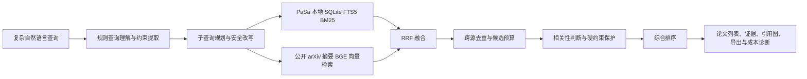

# ScholarNavigator 项目说明书草稿

> 提交前填写方括号中的团队信息，并仅使用 `outputs/benchmark_runs/` 的真实完整运行结果。

## 项目概述

**项目名称：** ScholarNavigator  
**赛题：** 企业赛题三，科研场景下复杂学术查询的智能论文搜索与推荐  
**团队：** [团队名称]  
**成员与分工：** [成员及分工]  

ScholarNavigator 面向带有研究领域、方法、数据集、时间、会议和排除条件的复杂学术查询，提供查询理解、多子查询检索、跨源去重、相关性判断、排序和结构化归纳。系统将本地 PaSa 标题 BM25 索引与公开 arXiv 摘要语义向量索引组合，在控制 API 调用、Token 和延迟的同时输出论文列表、证据说明、引用关系图和可导出结果。

## 问题与应用场景

科研人员常以自然语言描述复杂约束，而不是直接给出标准关键词。系统需要识别这些约束，生成可执行的检索子查询，在多个来源中获得候选论文，并解释每篇论文与用户需求的匹配依据。

适用场景包括文献调研、研究选题、方法/数据集追踪、跨领域论文发现和论文推荐。

## 系统方案



### 核心设计

1. **复杂查询理解**：识别方法、数据集、领域、时间、venue、论文类型和排除条件，生成受预算约束的子查询。
2. **混合检索**：PaSa 本地标题库提供低延迟 BM25 召回；公开 arXiv 标题+摘要子集提供 BGE 语义向量召回；RRF 融合降低单一路径漏召风险。
3. **标题库适配**：本地查询侧过滤自然语言填充词，避免礼貌语和泛化词主导标题检索；短查询与专名不被过滤为空。
4. **可解释排序**：返回匹配术语、标题/摘要/元数据证据、相关性类别和约束判定。
5. **成本可审计**：记录每次 API、重试、缓存、Token、延迟和失败，Benchmark 额外输出资源账本。

## 数据集与评测

主评测使用 PaSa/AutoScholarQuery。当前可审计 v3 证据显示语料为 569,432 条、arXiv ID 唯一，title/abstract/authors/year 完整，venue/DOI 覆盖分别为 12.152%/17.897%；已形成 200 条 Hybrid/Reranker 脱敏成对运行，但仍属于内部工程指标，不是赛事官方成绩。venue/DOI 全量门禁、1000 条正式成绩和官方 scorer 结果仍必须保持待填写。任何索引关联不得使用标题匹配、AutoScholarQuery gold 或 qrels。

指标：F1@20、Precision@20、Recall@20、MRR、nDCG、成功率、API 调用数、Token、延迟和失败率。

## 实验设置

| 配置 | 检索源 | 查询适配 | 判断与排序 |
| --- | --- | --- | --- |
| local baseline | local BM25 | adaptive | current_rules |
| hybrid candidate | local_hybrid: BM25 + BGE semantic + RRF | adaptive | current_rules |

完整实验命令与恢复方式见 `docs/contest/experiment-protocol.md`。

## 当前可填写的内部工程证据

当前 checkout 中没有可核验的 1000 条完整运行目录；已有 v3 200 条运行可用于内部工程表，但不能替代完整资格或官方 scorer。只有在运行目录、代码指纹、输入/索引哈希和资源账本均可读取后，才能填写正式成绩；内部 F1/Recall 不等同赛事官方 scorer。

| 配置 | 运行目录 | F1@20 | P@20 | R@20 | MRR | 平均 API | 平均 Token | 平均延迟 | 成功率 |
| --- | --- | ---: | ---: | ---: | ---: | ---: | ---: | ---: | ---: |
| v3 Hybrid baseline | `contest_qual200_metadata_v3_hybrid_baseline_eb7d151`（脱敏服务器资产） | 0.02108 | 待填 | 0.12850 | 待填 | 0 | 0 | 2.558 | 1.000 |
| v3 Hybrid + Reranker | `contest_qual200_metadata_v3_hybrid_reranker_eb7d151`（脱敏服务器资产） | 0.02137 | 待填 | 0.12797 | 待填 | 0 | 0 | 需按资源账本填写 | 1.000 |

以上为 200 条 v3 内部工程指标，不能写成赛事成绩；Reranker 未达到严格正向门禁，默认关闭。LLM、1000 条完整运行和官方 scorer 仍需单独核验。

## 创新点与边界

- 本地 PaSa 标题 BM25 与按 arXiv ID 精确关联的摘要 BGE 向量检索的受控混合召回。
- 从查询理解、检索调用到结构化结果的端到端可观测性，便于复现实验与成本分析。
- 结果级证据链、引用图与导出，支持科研人员复核推荐理由。
- Qwen3-Reranker-0.6B 使用固定官方判定模板、2048 token 上限、batch=8 与显式 GPU 隔离；soft Judgement 仅改变一个预先声明的阈值并通过配对 bootstrap 决策。

当前限制：旧 `local_hybrid` 标题匹配语料只能作为 legacy 对照；LLM v5-v16 均为诊断，尚无零 fallback、完整审计通过的 1000 条 LLM 结果。历史 soft Judgement 运行曾被记录，但当前 checkout 没有可核验的完整 RunId 与逐条产物，因此不引用其数字，也不把它写成已完成验证。Linux/Python 3.12 离线 wheelhouse 验证与 `record160` 历史冻结证据仍是最终 release tag 的阻塞项。

## 演示与复现

使用 VSCode 任务 `ScholarNavigator: run app` 启动系统。录制 3 到 5 条 `docs/contest/demo-queries.md` 中的复杂查询，展示输入、检索进度、结果证据、引用图、导出和运行成本。

### 算法流程文字版

1. 接收自然语言查询，抽取主题、方法、数据集、时间、venue、排除条件等结构化约束，并始终保留原始查询。
2. 由规则式规划器生成受预算约束的子查询；LLM 规划若启用，只能生成经过严格 JSON Schema 与本地约束校验的一条补充查询。
3. 在 PaSa 标题库执行 BM25，在按 arXiv ID 精确关联的 title+abstract 语料执行 BGE Faiss 检索；两路候选取并集并用固定 RRF 融合，保留原始检索分数和来源。
4. 对候选执行统一身份去重、硬约束检查和 Judgement；soft Judgement 仅作为独立、默认关闭的单阈值消融，不改变默认规则。
5. 使用 Qwen3-Reranker-0.6B 以固定模板对有限候选池重排，记录模型指纹、设备、batch、候选数、延迟和显存。
6. 输出 Top-20 论文、匹配证据、结构化摘要、引用关系图、导出结果和成本诊断。gold/qrels 只在此后用于离线指标与误差分析。

### 可复现实验命令

以下命令使用新 RunId；已有完成运行不重复覆盖。正式运行必须先通过同一 200 条资格门禁，完整命令、哈希约束和 resume 规则以 `docs/contest/experiment-protocol.md` 为准。

```powershell
.\scripts\run_contest_benchmark.ps1 -Mode qualification -Configuration rules -RunId <rules-qual-run-id>
.\scripts\run_contest_benchmark.ps1 -Mode qualification -Configuration dense -RunId <dense-qual-run-id>
.\scripts\run_contest_benchmark.ps1 -Mode qualification -Configuration reranker -RunId <reranker-qual-run-id> -RerankerDevice cuda:1
.\scripts\run_contest_benchmark.ps1 -Mode qualification -Configuration dense_reranker_soft -RunId <soft-qual-run-id> -RerankerDevice cuda:1
```

```bash
bash scripts/run_contest_benchmark.sh \
  --mode qualification \
  --configuration dense_reranker_soft \
  --run-id <soft-qual-run-id> \
  --reranker-device cuda:1
```

### 答辩讲解提纲

1. 问题：复杂科研查询同时包含主题、方法、数据集与排除约束，关键词检索容易漏召或误召。
2. 方法：规则查询理解驱动 BM25 与 Dense 双路召回，固定 RRF、证据级去重和神经重排共同提高可解释性与排序质量。
3. 数据治理：P0 语义语料只用规范化 arXiv ID 关联，拒绝标题匹配，gold/qrels 不进入在线链路。
4. 证据：展示 rules、Dense、reranker 的完整内部结果，以及候选召回、Judgement 和 Top-20 三阶段诊断；明确内部指标不是官方 scorer。
5. 可靠性：展示资源账本、checkpoint/resume、模型审计、失败/回退记录和发布包排除规则。
6. 边界：LLM 完整消融尚未达成零 fallback 和显著性门禁，故不作为实测创新成绩；最终 tag 仍受离线 wheelhouse 与历史 `record160` 证据阻塞。
