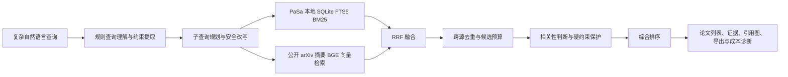

# ScholarNavigator 项目说明书草稿

> 提交前填写方括号中的团队信息，并仅使用 `outputs/benchmark_runs/` 的真实完整运行结果。

## 项目概述

**项目名称：** ScholarNavigator  
**赛题：** 企业赛题三，科研场景下复杂学术查询的智能论文搜索与推荐  
**团队：** [团队名称]  
**成员与分工：** [成员及分工]  

ScholarNavigator 面向带有研究领域、方法、数据集、时间、会议和排除条件的复杂学术查询，提供查询理解、多子查询检索、跨源去重、相关性判断、排序和结构化归纳。系统将本地 PaSa 标题 BM25 索引与公开 arXiv 摘要语义向量索引组合，在控制 API 调用、Token 和延迟的同时输出论文列表、证据说明、引用关系图和可导出结果。

## 问题与应用场景

科研人员常以自然语言描述复杂约束，而不是直接给出标准关键词。系统需要识别这些约束，生成可执行的检索子查询，在多个来源中获得候选论文，并解释每篇论文与用户需求的匹配依据。

适用场景包括文献调研、研究选题、方法/数据集追踪、跨领域论文发现和论文推荐。

## 系统方案

### 核心设计

1. **复杂查询理解**：识别方法、数据集、领域、时间、venue、论文类型和排除条件，生成受预算约束的子查询。
2. **混合检索**：PaSa 本地标题库提供低延迟 BM25 召回；公开 arXiv 标题+摘要子集提供 BGE 语义向量召回；RRF 融合降低单一路径漏召风险。
3. **标题库适配**：本地查询侧过滤自然语言填充词，避免礼貌语和泛化词主导标题检索；短查询与专名不被过滤为空。
4. **可解释排序**：返回匹配术语、标题/摘要/元数据证据、相关性类别和约束判定。
5. **成本可审计**：记录每次 API、重试、缓存、Token、延迟和失败，Benchmark 额外输出资源账本。

## 数据集与评测

主评测使用 PaSa/AutoScholarQuery。仓库中的公开文件包含 1000 条查询和 2403 个 arXiv gold 标识。PaSa 官方 `id2paper.json` 已转换为 569,432 篇本地标题语料；正式语义语料由 Cornell/arXiv 官方元数据按规范化 arXiv ID 精确关联得到同规模 title+abstract 语料。关联不使用标题匹配，也不使用 `AutoScholarQuery_test.jsonl`、gold 或 qrels 构建索引。旧 31,136 条标题匹配摘要子集仅保留为 legacy 证据，不进入正式成绩。

指标：F1@20、Precision@20、Recall@20、MRR、nDCG、成功率、API 调用数、Token、延迟和失败率。

## 实验设置

| 配置 | 检索源 | 查询适配 | 判断与排序 |
| --- | --- | --- | --- |
| local baseline | local BM25 | adaptive | current_rules |
| hybrid candidate | local_hybrid: BM25 + BGE semantic + RRF | adaptive | current_rules |

完整实验命令与恢复方式见 `docs/contest/experiment-protocol.md`。

## 已完成的诊断证据

2026 年 8 月 17 日，固定前 5 条真实运行中，local+arXiv 相比 arXiv 单源的 Recall@20 从 0.000 提升到 0.200，F1@20 从 0.000 提升到 0.019，平均 API 调用均为 2.2。该结果仅用于选择主候选配置，不代表完整 1000 条成绩。

已完成的完整结果：

| 配置 | F1@20 | P@20 | R@20 | MRR | 平均 API | 平均 Token | 平均延迟 | 成功率 |
| --- | ---: | ---: | ---: | ---: | ---: | ---: | ---: | ---: |
| local baseline | 0.0109 | 0.0062 | 0.0620 | 0.0407 | 0.0 | 0.0 | 0.777 s | 1.000 |
| hybrid candidate | 0.0147 | 0.0085 | 0.0846 | 0.0596 | 0.0 | 0.0 | 0.766 s | 1.000 |

阶段诊断显示，`local_hybrid` 的初始候选 Recall 为 0.145，最终返回 Recall@20 为 0.085，Judgement 假阴性率为 0.347；相比 `local_bm25` 的初始候选 Recall 0.131、最终返回 Recall@20 0.062、Judgement 假阴性率 0.467 有提升，但仍未解决主要召回瓶颈。

## 创新点与边界

- 本地 PaSa 标题 BM25 与公开摘要 BGE 向量检索的受控混合召回，适配普通 Windows 设备的内存限制。
- 从查询理解、检索调用到结构化结果的端到端可观测性，便于复现实验与成本分析。
- 结果级证据链、引用图与导出，支持科研人员复核推荐理由。

当前限制：旧 `local_hybrid` 的 F1@20 为 0.0147，但它采用标题匹配语料，只能作为 legacy 对照；P0/Faiss Dense 主线的完整结果必须从相应运行目录填写。神经 reranker 与 LLM 只有在完整 1000 条运行、资源账本和审计全部通过后才能填写为实测结论；Provider 不可用或运行不完整时必须明确标为未完成。

## 演示与复现

使用 VSCode 任务 `ScholarNavigator: run app` 启动系统。录制 3 到 5 条 `docs/contest/demo-queries.md` 中的复杂查询，展示输入、检索进度、结果证据、引用图、导出和运行成本。
